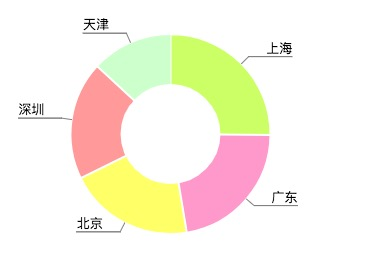

# 微信小程序 wepy 图表控件 `wepy-com-pie`

## 说明
基于微信小程序canvas开发的图表控件，适用于[wepy](https://github.com/wepyjs/wepy)框架


## 使用

### 引入 
 - 引入 `~/wepy-com-pie/src/extensions/Circle.js`
 - 引入 `~/wepy-com-pie/src/components/Pie.wpy`

### 使用
```javascript
<template>     
    <pie :dataSource.sync="dataSource"/>
</template>

<script>
  import wepy from 'wepy'
  import Pie from '@/components/Pie'

  export default class Index extends wepy.page {
    components = {
      pie: Pie
    }
  }
</script>
```

### Props 传值

| 属性       | 默认值   | 类型      | 必填 | 说明       |
|------------|--------|-----------|-----|-----------|
| dataSource | []     | array     | 是  | 图表数据    |

#### Tips:
 - dataSource 格式
 ```javascript
[{
    'key': '1',
    'value': '上海',
    'count': 251,
    'color': '#CCFF66'
}, ...]

 ```

### Emit 事件
| 函数           | 参数          | 返回值       | 说明                 |
|---------------|---------------|-----------|----------------------|
| onTapCanvasItem  | clickedItem     | void    | 选中canvas item |


### Pie UI data

| 属性           | 默认值          | 类型       | 说明                 |
|---------------|----------------|-----------|----------------------|
| canvasMargin  | 15             | number    | canvas 距离屏幕两侧距离 |
| canvasWidth   | 屏幕宽度 - canvasMargin * 2  | number | canvas 宽度 |
| canvasHeight  | 250            | number     | canvas 高度          |
| radius        | 100            | number     | 圆半径               |
| lineColor     | '#808080'      | string     | 标注线颜色            |
| textColor     | '#010101'      | string     | 标注字体颜色           |
| fontSize      | 13             | number     | 标注字体大小           |
